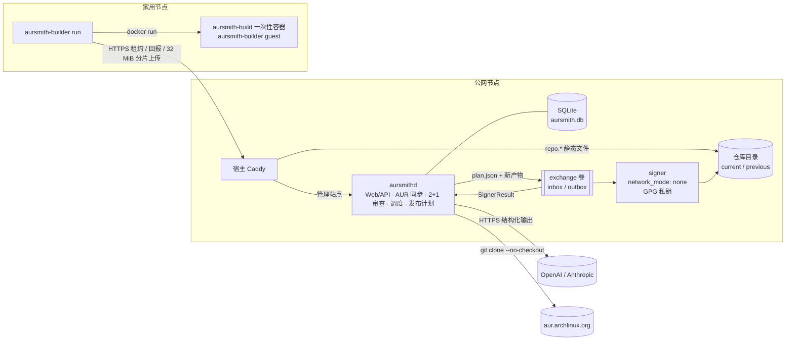
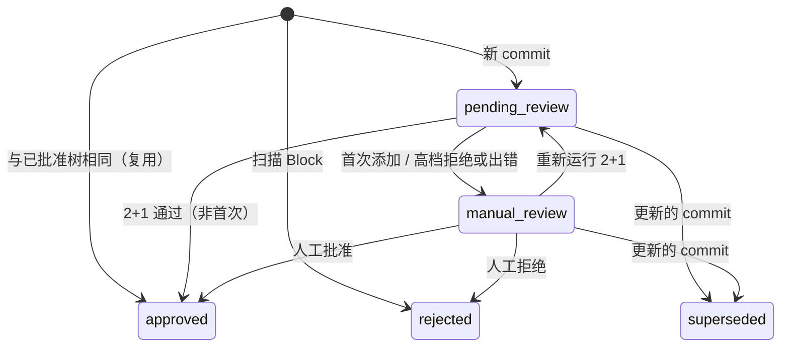

# 架构

权威需求见 `refactor-requirements.md`。本文描述代码结构与运行时数据流。

## 组件



## Crate

| crate | 类型 | 职责 |
|-------|------|------|
| `aursmith-core` | lib | 纯逻辑：名称/路径校验、`.SRCINFO` 静态解析、确定性扫描、依赖图、2+1 判定与严格报告解析、线协议类型 |
| `aursmithd` | bin | 公网主服务（`serve`）、签名器（`signer`）、管理员与迁移工具（`admin`、`export`、`import`、`verify`、`legacy-export`）、`healthcheck` |
| `aursmith-builder` | bin | 家用 Builder（`run`）与构建容器入口（`guest`） |

签名器与主服务共用一个二进制，但运行在不同容器：签名器没有网络、不打开数据库、不解析 AUR 内容，只处理 exchange 目录中的计划。

## aursmithd 模块

| 模块 | 内容 |
|------|------|
| `config` | 15 个环境变量 |
| `db` | 单一 SQLite + 内嵌迁移 `migrations/0001_schema.sql` |
| `auth` | 管理员会话（Cookie + 空闲/绝对过期）、Origin + CSRF 头校验、Builder Bearer 常量时间比较 |
| `aur` | AUR RPC、官方仓库查询、`git clone --no-checkout --template=` 快照、VCS commit 解析 |
| `packages` | 订阅闭包、依赖解析与 Provider 选择、revision 生成（扫描/复用/待审）、同步循环 |
| `review` | 2+1 审查循环、审查输入构造（文件 + diff）、OpenAI/Anthropic 结构化调用、人工审批 API |
| `builds` | 调度、租约、回报校验、分片上传、依赖产物下载、租约过期与瞬态重试 |
| `publish` | 期望状态、计划写入、签名结果收集、产物垃圾回收 |
| `signer` | 无网络签名器：校验、`repo-add`、签名、release 目录、原子切换、回滚、keyring |
| `state` | 状态导出/导入/校验与旧库导出 |
| `routes` | HTTP 路由、`/healthz`、`/api/v1/status`、`/api/v1/client-bootstrap` |

## 状态机



构建：`queued → running → uploading → succeeded`，任一阶段可 `failed`；瞬态失败在同一行 `attempt + 1` 回到 `queued`（最多重试 2 次）。

发布：`pending → published | failed`。

## 数据流细节

### 审查输入

- 全部 AUR 文本文件按 `<<<FILE path sha256=…>>>` 分隔；非首次附 `<<<DIFF .aursmith/previous-approved.diff>>>`；总量上限 1.5 MiB，超出则审查失败关闭（进入人工）。
- 报告 schema：`{verdict: approve|reject, summary, findings[{severity, category, message, file, line, evidence}], files_read[]}`，`additionalProperties: false`。

### Builder 工作目录

```
<jobs_dir>/<build_id>/
  state.json  input/{PKGBUILD,...,.aursmith/guest.json,.aursmith/deps/*}  output/  docker.log  report.json  reported
```

`jobs_dir` 在宿主与 Builder 容器内必须是同一绝对路径（bind mount 由宿主 dockerd 解析）。

### 仓库目录

```
x86_64/
  <pkg>.pkg.tar.zst(.sig) ...
  aursmith-repository-key.asc
  aursmith.db → releases/<plan_sha256>/<数据库文件>   （.db.sig、.files、.files.sig 同理，逐个原子替换）
  releases/<plan_sha256>/{<数据库文件>,<files 数据库文件>,manifest.json}(.sig)
  releases/current → <plan_sha256>
  releases/previous → <plan_sha256>
```

## 前后对比

| 指标 | 重构前 | 重构后 |
|------|--------|--------|
| Rust crate / 二进制 | 9 / 7 | 3 / 2 |
| Rust 代码行（含测试） | 16,176 | 10,516 |
| Rust 生产代码（约） | 11,750 | 7,970 |
| 公网容器 | 8 | 2 |
| 公网 Docker 网络 | 11 | 1 |
| 公网 secret | 8 | 4 |
| SQLite 数据库 | 3 | 1 |
| 数据表 / 迁移文件 | 27 / 35 | 9 / 1 |
| Dockerfile | 5 | 1（4 个 target） |
| 部署文件中的 `AURSMITH_*` 变量 | 86 | 32 |
| 代码读取的运行时变量 | — | 26 个不同名称（aursmithd 15、signer 3、builder 9，`EXCHANGE_DIR` 共用） |
